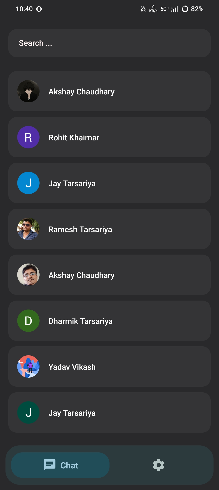
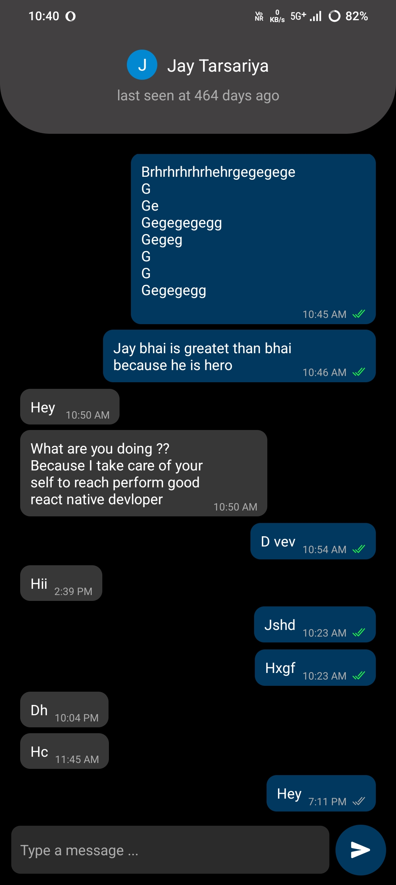
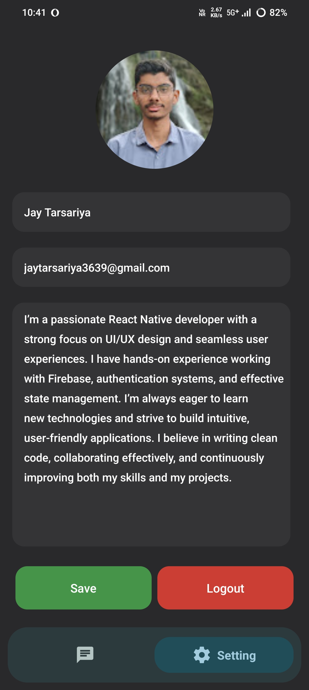

# React Native Real-Time Chat App

A real-time one-to-one messaging mobile application built with **React Native** and **Firebase Firestore**, featuring Google Sign-In, real-time messaging, typing indicators, read receipts, online/offline presence, and profile management.

## Screenshots

| Login                           | Chat List                               |
| ------------------------------- | --------------------------------------- |
|  |  |

| Chat Screen                                 | Settings                              |
| ------------------------------------------- | ------------------------------------- |
|  |  |

## Features

* Google Sign-In authentication
* One-to-one real-time messaging
* Firebase Firestore integration
* Real-time message updates
* Message timestamps
* Read/unread message status
* Unread message badges
* Typing indicators
* Online/offline presence
* Last seen status
* Local user search
* User profile management
* Profile image upload using Firebase Storage
* About Me profile information
* Bottom tab navigation
* Loading states
* Android support

## Tech Stack

* **React Native** – Mobile application development
* **JavaScript** – Application logic
* **Firebase Authentication** – User authentication
* **Firebase Firestore** – Real-time chat and user data
* **Firebase Storage** – Profile image storage
* **Google Sign-In** – Authentication
* **React Navigation** – Application navigation
* **React Native Image Picker** – Profile image selection

## Application Flow

```text
App Launch
    ↓
Firebase Authentication Check
    ↓
Google Sign-In
    ↓
Chat Application
    ↓
Chat List
    ↓
Select User
    ↓
One-to-One Chat
    ↓
Real-Time Messages
    ↓
Typing / Read Status / Online Presence
```

## Firebase Architecture

The application uses Firebase for authentication, real-time communication, user information, and profile images.

### Users

```text
users
 └── uid
      ├── displayName
      ├── email
      ├── photoURL
      ├── aboutMe
      ├── isOnline
      └── lastSeen
```

### Chats

```text
chats
 └── uid1_uid2
      ├── messages
      │    └── messageId
      │         ├── text
      │         ├── senderId
      │         ├── receiverId
      │         ├── isRead
      │         ├── timestamp
      │         └── time
      │
      └── typingStatus
           └── userId
                └── isTyping
```

The application uses Firestore realtime listeners to update messages, unread counts, typing status, and online presence.

## Project Structure

```text
ChatApp/
├── android/
├── ios/
├── src/
│   ├── assets/
│   └── ChatApp.js
├── App.js
├── index.js
├── package.json
├── babel.config.js
├── .env.example
├── .gitignore
└── README.md
```

## Environment Configuration

The Google Sign-In web client ID is loaded through an environment variable instead of being hardcoded in the source code.

Create a `.env` file based on `.env.example`:

```env
GOOGLE_WEB_CLIENT_ID=your_google_web_client_id
```

**Do not commit `.env` to GitHub.**

The real Firebase configuration files are also excluded from the repository.

For Android, provide your own:

```text
android/app/google-services.json
```

For iOS, provide your own:

```text
ios/GoogleService-Info.plist
```

## Getting Started

### 1. Clone the repository

```bash
git clone https://github.com/jaytarsariya-dev/react-native-realtime-chat.git
```

### 2. Navigate to the project

```bash
cd react-native-realtime-chat
```

### 3. Install dependencies

```bash
npm install
```

### 4. Configure Firebase

Create your own Firebase project and enable:

* Firebase Authentication
* Google Sign-In
* Cloud Firestore
* Firebase Storage

Add your Android Firebase configuration:

```text
android/app/google-services.json
```

Create your `.env` file using `.env.example` and configure:

```env
GOOGLE_WEB_CLIENT_ID=your_google_web_client_id
```

### 5. Start Metro

```bash
npm start
```

### 6. Run Android

```bash
npm run android
```

For iOS, configure the required Firebase iOS configuration and CocoaPods dependencies before running the application.

## Security

This repository does not include:

* Firebase configuration files
* Environment files containing real values
* Hardcoded Google Sign-In client configuration
* Private credentials
* API secrets
* Debug keystores

Developers should provide their own Firebase configuration and environment variables when running the application locally.

## Future Improvements

Potential improvements for future versions include:

* Push notifications
* Image and file messaging
* Message editing and deletion
* Group conversations
* Reply functionality
* Improved application architecture by separating screens and services
* Additional profile customization

## Developer

**Jay Tarsariya**

React Native Developer

GitHub: [jaytarsariya-dev](https://github.com/jaytarsariya-dev)

## License

This project is available for learning and portfolio purposes.
